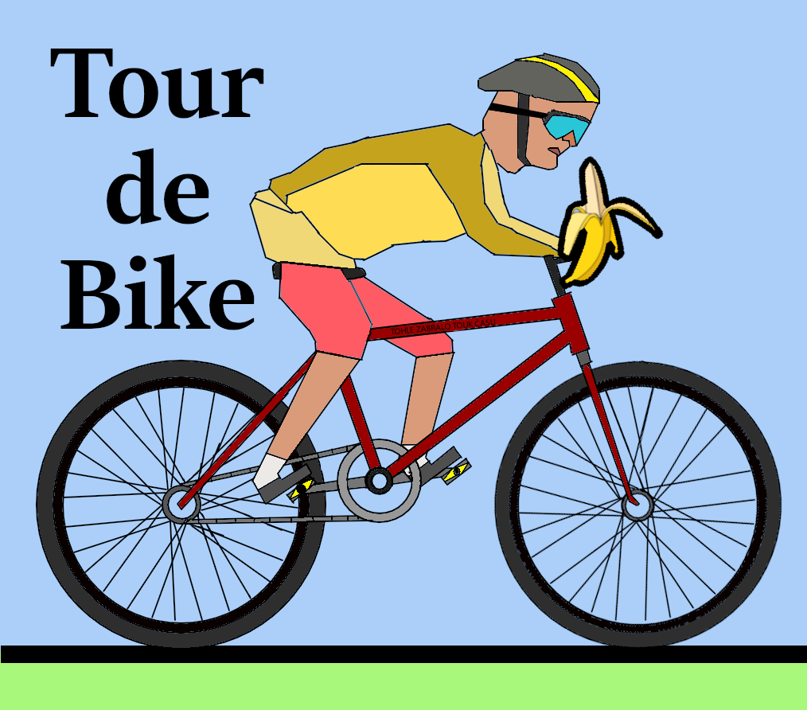

# Tour de Bike
[](LICENSE)
[](https://www.python.org/)
[](https://www.pygame.org/)

Basic 2D physics game <br>
Inspired by [Hill Climb Racing](https://play.google.com/store/apps/details?id=com.fingersoft.hillclimb) <br>

## Getting Started
### Dependencies
- [Python 3.8+](https://www.python.org/downloads/)
- [Pygame 2.0+](https://www.pygame.org/)

### Running the game
1. **Clone** this repository.
2. Make sure you have **Python** installed.
3. Install pygame using: 
``` 
pip install pygame
```
4. Start the game by running main.py or using makefile
```
python main.py
```
## Controls
| Key | Action |
| --- | --- |
| A | Move left / rotate clockwise in air |
| D | Move right / rotate anticlockwise in air |
| ESC | Open pause menu / go to main menu |

## Authors
- [Filakcz](https://github.com/Filakcz) - almost everything
- [Dremer3135](https://github.com/Dremer3135) - physics, antialiasing, playtesting
- [anteat3r](https://github.com/anteat3r/) - bugfix stones, playtesting
- [Paidarovec](https://github.com/HeatLair814) - background music, playtesting

## License

This project is licensed under the [Apache License 2.0](LICENSE).

